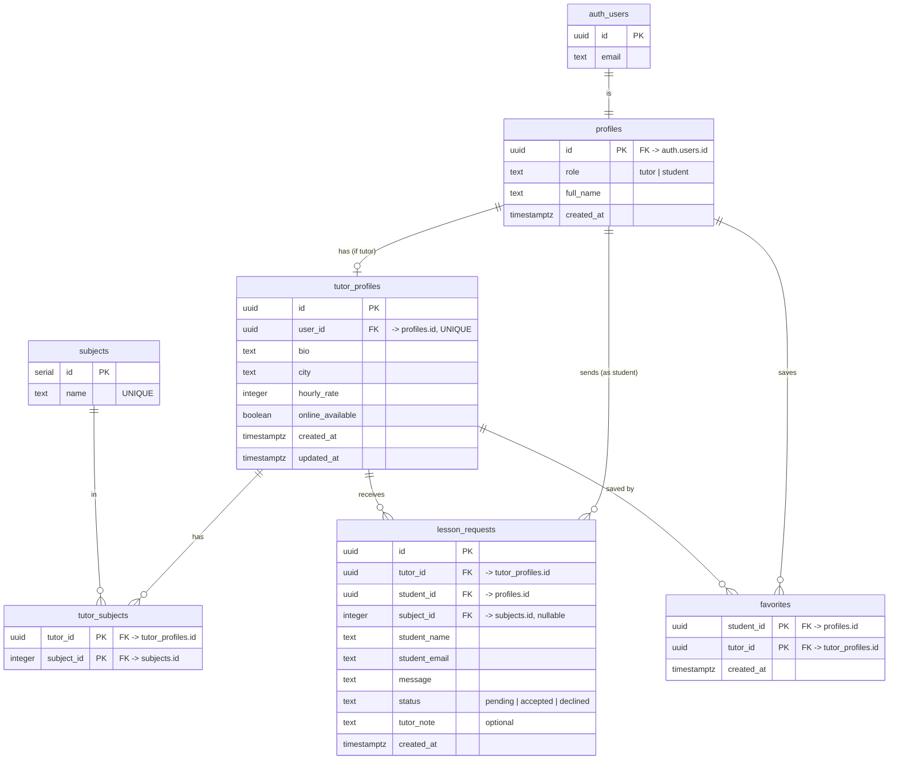

# TutorMatch — Entity Relationship Diagram

## Diagram

## Tables

### `profiles`
One row per authenticated user; holds the role and display name.

| Column | Type | Key | Notes |
|---|---|---|---|
| id | uuid | PK, FK → `auth.users.id` | cascade on delete |
| role | text | | `CHECK (role IN ('tutor','student'))` |
| full_name | text | | not null |
| created_at | timestamptz | | default `now()` |

### `tutor_profiles`
Extra details for users whose role is `tutor` (1:1 with `profiles`).

| Column | Type | Key | Notes |
|---|---|---|---|
| id | uuid | PK | default `gen_random_uuid()` |
| user_id | uuid | FK → `profiles.id`, UNIQUE | cascade on delete |
| bio | text | | nullable |
| city | text | | not null |
| hourly_rate | integer | | `CHECK (hourly_rate >= 0)` |
| online_available | boolean | | default false |
| created_at | timestamptz | | default `now()` |
| updated_at | timestamptz | | default `now()` |

### `subjects`
Fixed catalogue of subjects (seeded).

| Column | Type | Key | Notes |
|---|---|---|---|
| id | serial | PK | |
| name | text | UNIQUE | not null |

### `tutor_subjects`
Many-to-many link between tutors and subjects.

| Column | Type | Key | Notes |
|---|---|---|---|
| tutor_id | uuid | PK, FK → `tutor_profiles.id` | cascade on delete |
| subject_id | integer | PK, FK → `subjects.id` | cascade on delete |

Composite primary key `(tutor_id, subject_id)`.

### `lesson_requests`
A lesson inquiry from a student to a tutor. Immutable.

| Column | Type | Key | Notes |
|---|---|---|---|
| id | uuid | PK | default `gen_random_uuid()` |
| tutor_id | uuid | FK → `tutor_profiles.id` | cascade on delete |
| student_id | uuid | FK → `profiles.id` | cascade on delete |
| subject_id | integer | FK → `subjects.id` | nullable; `ON DELETE SET NULL` |
| student_name | text | | snapshot at send time |
| student_email | text | | snapshot at send time |
| message | text | | not null |
| status | text | | `CHECK (status IN ('pending','accepted','declined'))`, default `pending` |
| tutor_note | text | | nullable; set by the tutor on accept/decline |
| created_at | timestamptz | | default `now()` |

### `favorites`
Tutors a student has saved (many-to-many).

| Column | Type | Key | Notes |
|---|---|---|---|
| student_id | uuid | PK, FK → `profiles.id` | cascade on delete |
| tutor_id | uuid | PK, FK → `tutor_profiles.id` | cascade on delete |
| created_at | timestamptz | | default `now()` |

Composite primary key `(student_id, tutor_id)`.

## Relationships

- `auth.users` **1—1** `profiles` (profile created by a signup trigger).
- `profiles` **1—1** `tutor_profiles` (only for tutors).
- `tutor_profiles` **M—N** `subjects` via `tutor_subjects`.
- `tutor_profiles` **1—N** `lesson_requests` (a tutor receives many).
- `profiles` **1—N** `lesson_requests` (a student sends many).

## Row Level Security (summary)

- **profiles** — public read; insert/update only your own row.
- **tutor_profiles** — public read; insert/update/delete only your own (insert also requires role = tutor).
- **subjects** — public read; no client writes.
- **tutor_subjects** — public read; a tutor manages links only for their own tutor row.
- **lesson_requests** — insert only as yourself (`student_id = auth.uid()`); readable by the sending student or the target tutor; the target tutor may update (used to set `status`/`tutor_note`); no delete.
- **favorites** — fully private: a user may select/insert/delete only rows where `student_id = auth.uid()`.
